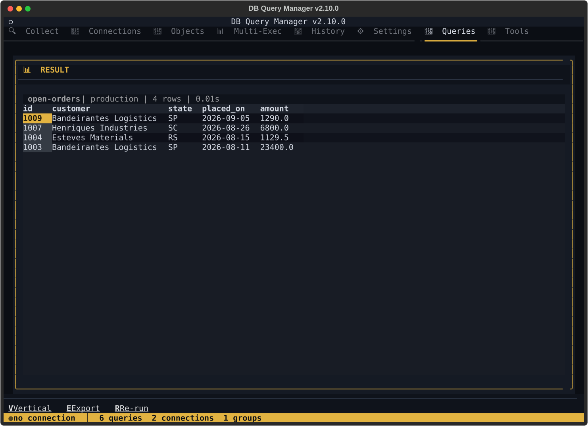
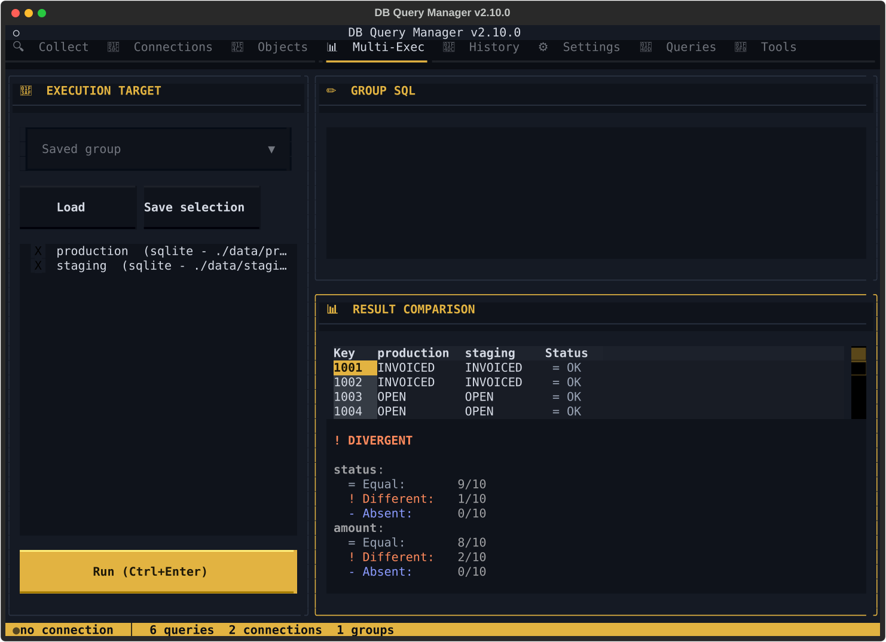

# DB Query Manager (dbqm)

[](https://pepy.tech/project/dbqm)

Fullscreen terminal application **and** scriptable CLI for running SQL across
**Oracle**, **SQL Server**, **PostgreSQL**, **MySQL** and **SQLite** — from one
place, with one set of saved connections. Built with
[Textual](https://textual.textualize.io/).

Every operation is available without a TTY, so the same tool serves a person at
a terminal and a script, a CI job or an AI agent.



## Install

```bash
pip install dbqm
```

Python 3.10+. The drivers come with it, and SQLite needs none — it is in the
standard library. Oracle connections additionally need the Oracle Instant
Client, which dbqm can download for you from Settings › Oracle Instant Client.

Installing from source, the `win-arm64` caveats and what each dependency is
for: **[docs/INSTALL.md](./docs/INSTALL.md)**.

## Start here

```bash
dbqm
```

Opens the dashboard: eight tabs (`F1`–`F8`), ad-hoc SQL, an object browser,
cross-database comparison, saved queries, history and tools. On first launch it
creates `~/.dbqm/`, generates an encryption key and walks you through your first
connection. Keys, tabs and the comparison screens:
**[docs/TUI.md](./docs/TUI.md)**.

Or skip the interface entirely:

```bash
# A SQLite file needs nothing but its path — no host, no user, no password.
dbqm connection add local --type sqlite --database ./meu.db --no-password

# Run SQL. -f json for a machine, -f raw to pipe a CLOB somewhere else.
dbqm sql "SELECT * FROM pedidos WHERE status = :s" local -p s=PAGO -f json

# Save a query once, run it with different parameters later.
dbqm run pedidos-em-aberto -p data_inicio=2026-01-01

# Compare one statement across connections. Exits 5 when they diverge.
dbqm multi "SELECT id, total FROM pedidos" -c prod -c homolog -f json

# See a database's shape without writing catalogue SQL.
dbqm objects prod --type TABLE
dbqm describe pedidos prod
dbqm rows pedidos prod --limit 20
```

Every command, every flag, the JSON envelope and the exit codes:
**[docs/CLI.md](./docs/CLI.md)**. Or ask the program — `dbqm describe-cli -f json`
reports its own surface, read from the parser rather than from a list someone
has to remember to update.

## What it does

**Run and compare**

- **Saved queries** with named parameters, folders, favourites and a DE-PARA
  column mapping for values that differ between systems
- **Cross-database comparison** — run the same logical query against several
  connections and get a per-row `OK` / `DIFF` / `ABSENT` verdict, as a table or
  an interactive HTML report. `dbqm multi` does it for one ad-hoc statement,
  without saving anything
- **Ad-hoc SQL** — SELECT, CTEs, DML with `--commit`, DDL with compilation-error
  detection, and anonymous PL/SQL blocks with `DBMS_OUTPUT` captured and shown
- **Execution plans** — `dbqm sql "<query>" <conn> --explain` in one step, on
  every engine that has one
- **Execute routines** — Oracle packages, procedures and functions, with
  parameters in and OUT values and the return value back as data



**Look around**

- **Object browser** — tables, views, routines and Oracle packages: columns,
  primary keys, foreign keys and indexes, on every engine
- **Schema discovery from the CLI** — `objects`, `describe` and `rows`, paged
- **DDL extraction** — Oracle (`DBMS_METADATA`), PostgreSQL (`pg_catalog`),
  MySQL (`SHOW CREATE`), SQLite (`sqlite_master`, verbatim)
- **Package editor** for Oracle PL/SQL, with inline compilation errors
- **Execution history** with timing, row counts and status

**Curate without the TUI**

- `dbqm connection|query|group|template add|update|show|rm|list` — the same
  validation both front ends use, `-f json` everywhere, `update` changes only
  the flags you pass
- `dbqm config get|set|list` — valid keys and themes are read at runtime, so
  neither list can go stale; a bad value is refused, not coerced
- **Portable configuration** — export and import as an encrypted `.dbqm` bundle

**Stay out of trouble**

- **Read-only connections** — mark one and dbqm declines to send it anything but
  a query, with a one-invocation `--force-write` override for `dbqm sql`
- **Encrypted credentials** — Fernet at rest; passwords read from stdin or the
  environment, never from `argv`
- **Exports** — CSV, JSON, TXT, HTML and SQL, plus IDE-style execution evidence
  (the SQL, the connection, the timestamp, the outcome) for an audit trail
- **Audit logging** — opt-in, append-only JSON
- **English and Portuguese** — every screen, message and `--help` string comes
  from a catalogue; `dbqm config set language pt`, or `DBQM_LANG` for one run

Where dbqm keeps its files, where exports land and which language it speaks:
**[docs/CONFIGURATION.md](./docs/CONFIGURATION.md)**.

## Security

- Database passwords encrypted at rest using Fernet (`.dbqm_key` master key)
- Configuration bundles use PBKDF2 (480,000 iterations) + Fernet
- Queries use bind variables; SQL identifiers validated against an allowlist
- Query results capped at 10,000 rows; bundle imports limited to 10 MB
- HTML reports escape all user-controlled values
- Audit log files created with restricted permissions
- File open operations restricted to the exports directory

Read-only connections are a rail against mistakes, not a security boundary —
[CHANGELOG.md](./CHANGELOG.md) says what that means and what is deferred.

## Documentation

| | |
|---|---|
| [docs/INSTALL.md](./docs/INSTALL.md) | From source, `win-arm64`, dependencies |
| [docs/CLI.md](./docs/CLI.md) | Every command, the JSON envelope, exit codes |
| [docs/TUI.md](./docs/TUI.md) | Tabs, keyboard map, comparison screens |
| [docs/CONFIGURATION.md](./docs/CONFIGURATION.md) | Data directory, export destination, language |
| [CHANGELOG.md](./CHANGELOG.md) | Release history |
| [docs/ROADMAP.md](./docs/ROADMAP.md) | Known bugs first, then what is planned |
| [docs/ARCHITECTURE.md](./docs/ARCHITECTURE.md) | Layout, layering, patterns, recorded debt |
| [AGENTS.md](./AGENTS.md) | The development workflow, for humans and agents alike |

MIT licensed.
