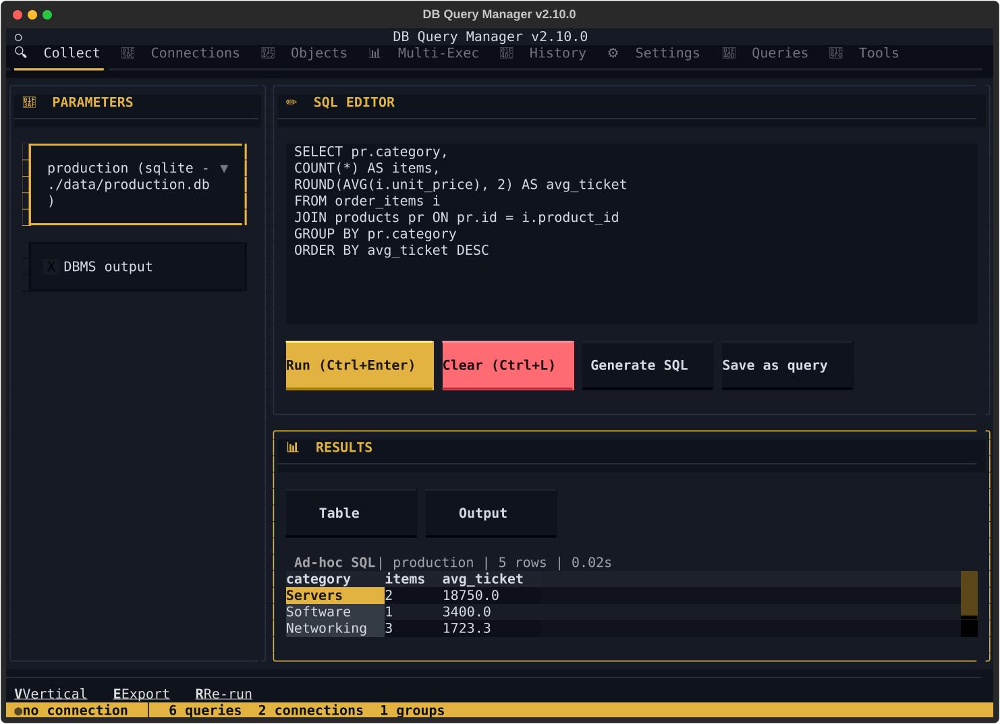
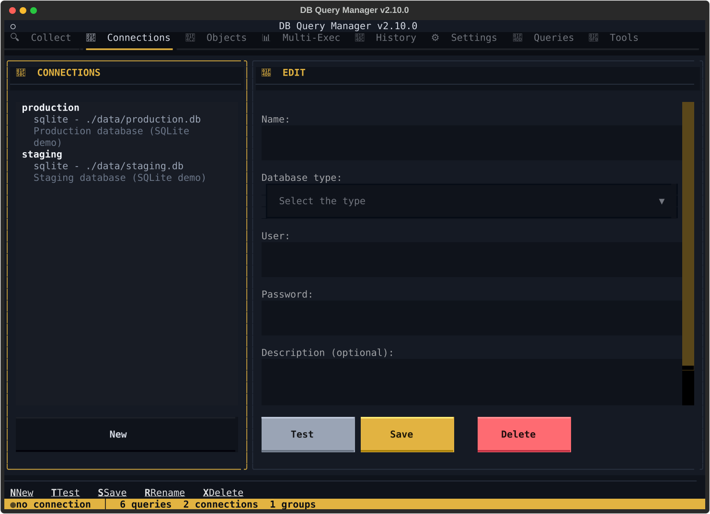

# The terminal app

dbqm's fullscreen interface: one tabbed dashboard, driven entirely from the
keyboard. Run `dbqm` with no arguments to open it.

[← Back to the README](../README.md)

---

## Opening it

```bash
dbqm
# or
python -m dbqm
```

On first launch, the app creates its data directory (`~/.dbqm`), prompts you to configure your first database connection, and generates an encryption key.

## The screens

**Collect** (`F1`) — ad-hoc SQL against one connection, `Ctrl+Enter` to run.
Parameters are detected in the text; `DBMS output` opts the run into
DBMS_OUTPUT capture.



**Queries** (`F7`) — saved queries, filtered by folder, by connection or by
free text, and their results.


**Multi-Exec** (`F4`) — one statement across the connections you tick, compared
row by row. The verdict and the per-column counts sit under the table.


**Connections** (`F2`) — the connections, their engine, their target and their
description.



## Keyboard Navigation

The application is fully keyboard-driven:

| Key | Action | Context |
|-----|--------|---------|
| `F1`–`F8` | Switch dashboard tab | Global |
| `↑` `↓` | Navigate items / widgets | Lists, tables, forms |
| `Enter` | Select / Confirm | Global |
| `Escape` | Go back | Global |
| `Ctrl+B` | Toggle Templates sidebar | Global |
| `Ctrl+Q` | Quit | Global |
| `/` | Search / filter | Lists |
| `?` | Help (shortcuts) | Global |
| `Tab` | Next widget | Forms, settings |
| `V` | Vertical view | Query results |
| `E` | Export | Query/group results |
| `R` | Re-execute | Query/group results |
| `M` | Toggle mapped/original values | Query/group results |
| `F` | Toggle flat/pivoted | Group results |
| `S` | Filter by status | Group results |
| `H` | HTML report | Group results |
| `Ctrl+Enter` | Execute SQL | Ad-hoc SQL |
| `Ctrl+L` | Clear SQL input | Ad-hoc SQL |
| `X` | Clear history | History |
| `N` | New item | Connections, queries |
| `D` | Delete / Details | Connections, history |
| `C` | Compile Spec | Package editor |
| `B` | Compile Body | Package editor |

## Dashboard tabs

The app is a single tabbed dashboard. Switch tabs with `F1`–`F8`:

| Key | Tab | Content |
|-----|-----|---------|
| `F1` | 🔍  Collect | Ad-hoc SQL |
| `F2` | 🔌  Connections | Manage database connections |
| `F3` | 📂  Objects | Object browser |
| `F4` | 📊  Multi-Exec | Run one ad-hoc SQL across selected connections & compare (load/save as a group) |
| `F5` | 📜  History | Execution history |
| `F6` | ⚙️  Settings | Settings (includes Export / Import) |
| `F7` | 📝  Queries | Run saved queries |
| `F8` | 🧰  Tools | Manage Groups/Templates, Package editor, Run Routine |

A collapsible **Templates** sidebar (`Ctrl+B`) lists saved SQL templates; choosing one injects its SQL into the active tab's editor.

Above the status bar, a contextual **action bar** shows the actions available on the current screen with their shortcut keys (`N New`, `T Test`, …); the entries are clickable too. Screens that open a deeper screen inside their own tab — Settings › Oracle Instant Clients and Settings › Export / Import — announce `Esc Back` there, which is how you go back.

The screens are in English by default and translated into Portuguese; see
[Configuration → Language](CONFIGURATION.md#language).

## Query Groups & Comparison

Groups run the same logical query across multiple databases and compare results:

- Define a **join key** (row identifier) and **comparison columns**
- Optional **normalization mapping** for semantic equivalence (e.g., "paga" = "pago")
- Optional **column mapping** for mismatched column names
- Results show status per row: `OK`, `DIFF`, `ABSENT`
- Two display modes: **flat** (one table per column) and **pivoted** (one table per key)
- Filter results by status (divergent, absent, or combined)
- Export as HTML report with interactive filters
- **Report templates**: attach a template to a group, configure field sources (auto from query results or manual input), and render formatted reports after execution

## What the interface gives you

- **Fullscreen TUI** — Single tabbed dashboard (8 tabs, `F1`–`F8`), collapsible Templates sidebar, status bar, and keyboard-driven workflow
- **Dark/Light themes** — "Plano" design system (dark default, light variant), switchable in settings; shared design tokens (`dbqm/design/tokens.py`) drive the TUI, CLI output, and HTML reports so all three stay visually consistent
- **Report templates** — Define text templates with `{{field}}` placeholders, auto-fill from query results or manual input, export rendered reports. Curate them from the CLI too: `dbqm template add|update|show|rm|list`, over the same `core/template_builder.py` validation the TUI uses. Content is stored verbatim — never stripped, since whitespace in a report body is formatting — but content that is only whitespace is refused
- **Ad-hoc SQL** — Execute SQL with parameter detection, Ctrl+Enter shortcut, connection validation, and clear with confirmation. Supports CTEs (`WITH ... SELECT`), anonymous PL/SQL blocks (`DECLARE`/`BEGIN`/`END;`, with an optional trailing `/` terminator and leading `--`/`/* */` comments) and the `EXEC`/`EXECUTE`/`CALL <proc>` shortcuts on Oracle, with DBMS_OUTPUT capture displayed after execution (TUI and CLI). In the TUI, a **"DBMS output"** checkbox opts SELECT/DML executions into capture; captured logs appear in a dedicated panel below the result with **Save to file** and **Copy to clipboard** buttons (anonymous PL/SQL blocks always show their output). Saving or copying produces an IDE-style **execution evidence** record — the executed SQL, connection, date/time, DBMS_OUTPUT and the outcome — for a self-contained audit trail.
- **Toggle mapping** — Switch between mapped and original values in query and group results
- **Data export** — Export results to CSV, JSON, TXT, HTML reports, and SQL files. Destination is configurable in Settings (defaults to the current working directory); query exports are written flat (no subfolders), while groups/DDL/SQL keep category subfolders by default (togglable). On first export you are prompted to pick a default location.
- **Connection descriptions** — Attach free-form notes to each connection (purpose, schema, contacts); a one-line preview is shown alongside type and destination in the connections list
- **Favorites & folders** — Organize queries in folders, star favorites for quick access
- **Query filtering** — On the "Run query" screen, an always-visible filter bar narrows saved queries by free text (name or description) and/or by connection; filters combine (AND) and stack on top of the folder select
- **Paginated results** — Navigate large result sets with next/prev page controls
- **Error handling** — Global error modal displays details instead of crashing the app
